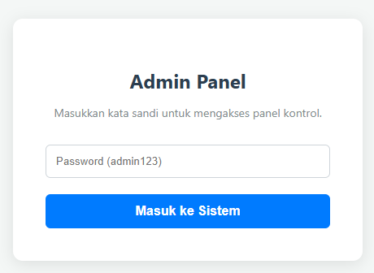
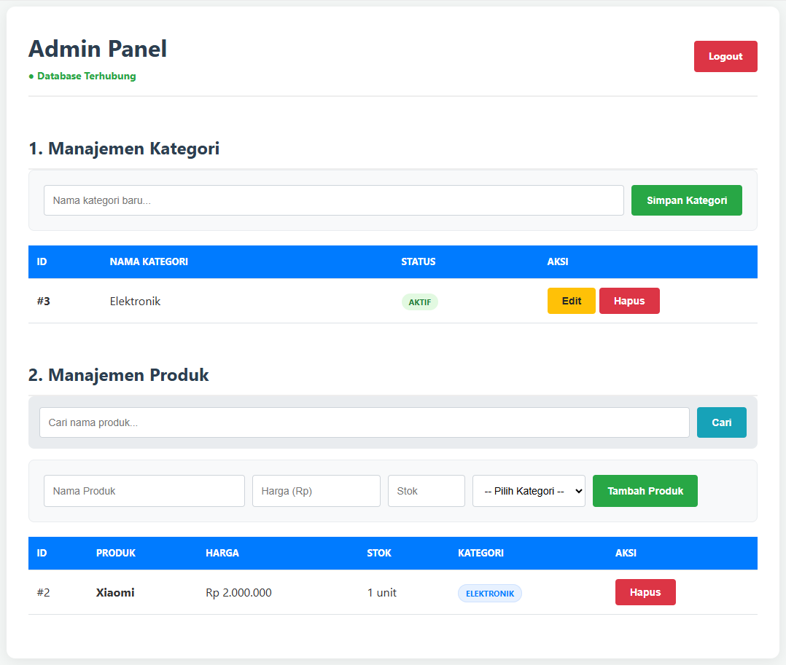
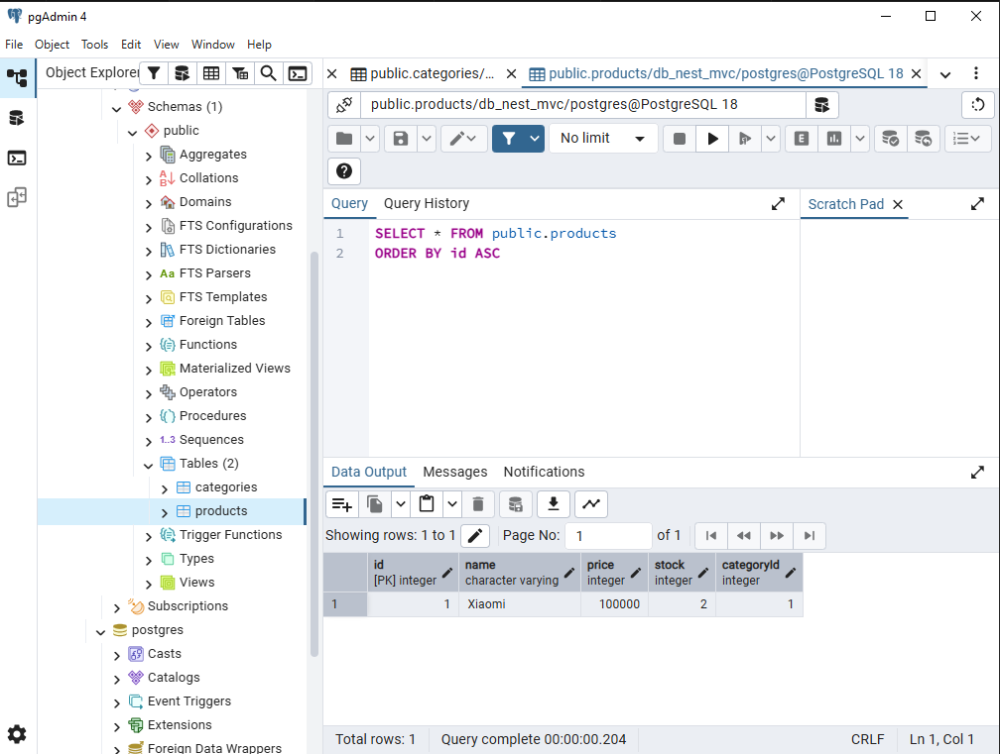

# Admin Panel Manajemen Produk - NestJS & PostgreSQL

Project ini adalah aplikasi Admin Panel sederhana untuk manajemen data kategori dan produk yang dibangun menggunakan **NestJS**, **TypeORM**, dan **EJS** sebagai template engine. Aplikasi ini dibuat untuk memenuhi tantangan Fullstack TypeScript dengan pola arsitektur **MVC** (Model-View-Controller).

## 🚀 Fitur Utama
* **Autentikasi Session**: Login admin dengan proteksi session.
* **CRUD 2 Tabel**: Manajemen lengkap untuk data Kategori dan Produk.
* **Relasi Database**: Implementasi relasi *One-to-Many* antara Kategori dan Produk.
* **Fitur Pencarian**: Mencari produk secara dinamis berdasarkan nama.
* **UI Interaktif**: Menggunakan SweetAlert2 untuk konfirmasi hapus dan logout.

---

## 📊 Desain Database (ERD)
Berikut adalah struktur tabel yang digunakan dalam aplikasi ini (dirancang menggunakan dbdiagram.io):


> *Catatan: Relasi antara Tabel Kategori dan Tabel Produk adalah One-to-Many.*

---

## 📸 Screenshot Aplikasi

### 1. Halaman Login
Halaman awal untuk autentikasi admin sebelum masuk ke panel kontrol.


### 2. Dashboard Admin (Manajemen Data)
Tampilan utama yang menampilkan list kategori, list produk dengan format rupiah, dan fitur pencarian.


### 3. Struktur & Data Database (PostgreSQL)
Tampilan data yang tersimpan di dalam tabel PostgreSQL (melalui GUI Database Manager).


---

## 🛠️ Dependency (Teknologi yang Digunakan)
* **Framework**: [NestJS](https://nestjs.com/)
* **Bahasa**: TypeScript
* **Database**: PostgreSQL
* **ORM**: TypeORM
* **Template Engine**: EJS
* **Session Management**: express-session
* **UI Helper**: SweetAlert2, CSS Native

---

## ⚙️ Cara Menjalankan Project

1. **Clone Repository**
   ```bash
   git clone <link-repository-kamu>
   cd <nama-folder-project>
   ```

2. **Instalasi Dependency**
   ```bash
   npm install
   ```

3. **Konfigurasi Database (PostgreSQL)**
   * Buka file src/app.module.ts dan sesuaikan konfigurasi koneksi PostgreSQL kamu:
   * Host: localhost
   * Port: 5432
   * Username: postgres
   * Password: (password_user)
   * Database: nama_database_kamu

4. **Jalankan Aplikasi**
   ```bash
   npm run start:dev
   ```
   Aplikasi dapat diakses di: http://localhost:3000

5. **Informasi Akun Admin**
   * Password: admin123
